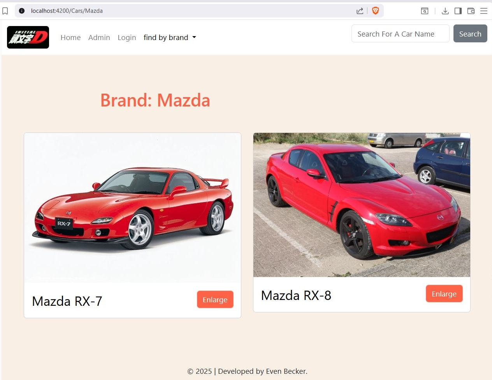

# The Initial D Cars App

## Tech Stack
- ASP.Net core 6 Web Api.
- Entity Framework Core.
- Angular 15.
- Sass.
- Bootstrap 5.
- Microsoft SQL Server.

## Features
- user authentication.
- visitor mode for viewing cars
- admin mode for adding and deleting cars. It also features an image upload button.

## Configuration
### Asp.Net Core Web API
- Go To `ConfiguredValues.cs`.
- Change the values to your local ports, `GetClient` will be Angulars Default port and `GetServer` will be the server default port, they are defaulty set to: `https://localhost:7099` (server) and `http://localhost:4200` (client).
- Change servername to your local mssql server name, in `appsettings.json`.
- Go to tools in VS studio > nuget package manager > package manager console > write: `Update-Database`

### Angular
- Open the 'Client' folder using CLI and enter `npm install`.
- Go To `myEnvironment.ts`.
- Change the `ServerUrl` to your server default port, it is defaulty set to: `https://localhost:7099`.

### MS SQL Server
- Open the SQL query scripts located in ./doc/ 
- Execute the query scripts in your new created database. It will create and populate two tables: Cars and Users.

## Running The Project
- Open the Server Project in Visual Studio, then run it (it will also open Swagger in your browser).
- Open the 'Client' folder using CLI and enter `ng serve`.
- Enter your Angular port url in the browser, it is usually `http://localhost:4200/`.

